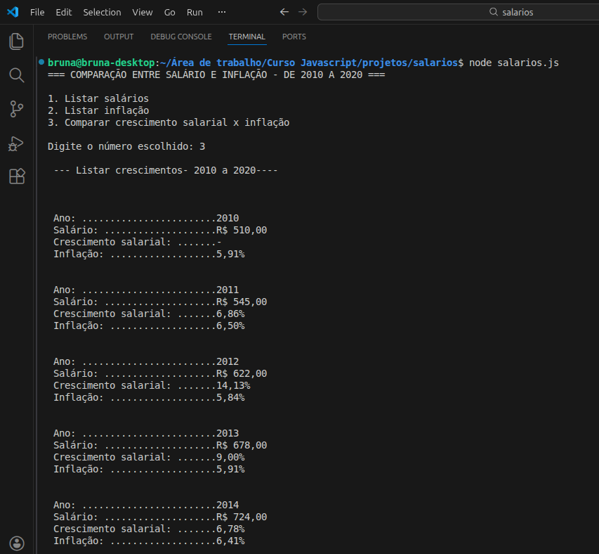

# Comparativo salário mínimo x inflação
Aplicação desenvolvida em JavaScript, considerando dados do período de 2010 a 2010.
 

## Objetivo:
Aplicar conhecimentos de Lógica de programação e JavaScript;

## Funcionalidades:
1. Listar salários
2. Lista inflação
3. Lista comparativo de crescimento do salário mínimo e dados dos itens 1 e 2.

## Para abrir a aplicação:
Necessário utilizar o terminal do VSCode
comando node salarios.js

# Print 

